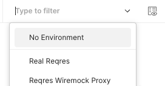
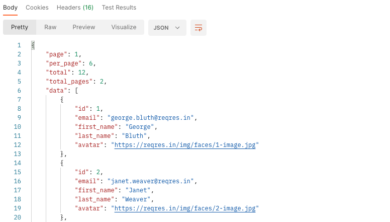
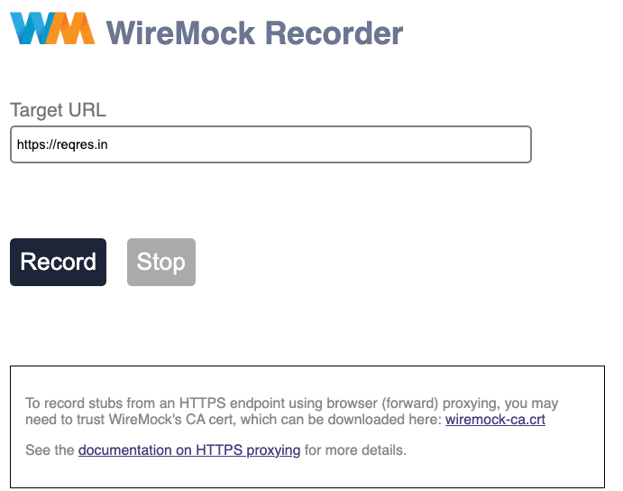
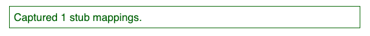
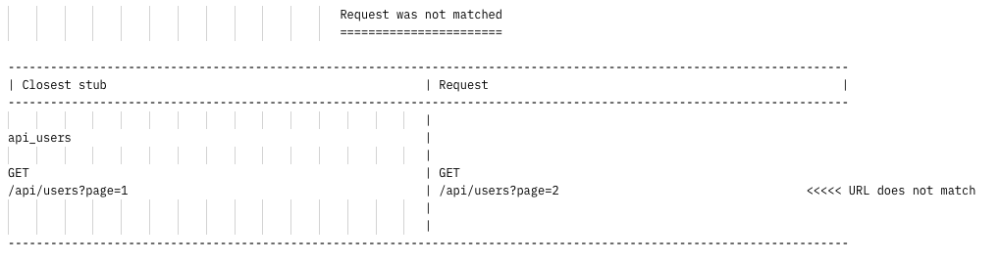

<!-- Improved compatibility of back to top link: See: https://github.com/othneildrew/Best-README-Template/pull/73 -->
<a name="readme-top"></a>
<!-- PROJECT SHIELDS -->
<!--
*** I'm using markdown "reference style" links for readability.
*** Reference links are enclosed in brackets [ ] instead of parentheses ( ).
*** See the bottom of this document for the declaration of the reference variables
*** for contributors-url, forks-url, etc. This is an optional, concise syntax you may use.
*** https://www.markdownguide.org/basic-syntax/#reference-style-links
-->


<!-- PROJECT LOGO -->
<br />
<div align="center">

<h3 align="center"><a href="https://github.com/xescuder/wiremock-java">Wiremock for Java</a></h3>

  <p align="center">
    In this project we'll see how to setup a proxy Wiremock Server and how to test it with req.in
    <br />
    <a href="https://github.com/github_username/repo_name"><strong>Explore the docs »</strong></a>
    <br />
    <br />
    <a href="https://github.com/github_username/repo_name">View Demo</a>
    ·
    <a href="https://github.com/github_username/repo_name/issues">Report Bug</a>
    ·
    <a href="https://github.com/github_username/repo_name/issues">Request Feature</a>
  </p>
</div>


<!-- TABLE OF CONTENTS -->
<details>
  <summary>Table of Contents</summary>
  <ol>
    <li>
      <a href="#about-the-project">About The Project</a>
      <ul>
        <li><a href="#built-with">Built With</a></li>
      </ul>
    </li>
    <li>
      <a href="#getting-started">Getting Started</a>
      <ul>
        <li><a href="#prerequisites">Prerequisites</a></li>
        <li><a href="#installation">Installation</a></li>
      </ul>
    </li>
    <li><a href="#usage">Usage</a></li>
    <li><a href="#roadmap">Roadmap</a></li>
    <li><a href="#contributing">Contributing</a></li>
    <li><a href="#license">License</a></li>
    <li><a href="#contact">Contact</a></li>
    <li><a href="#acknowledgments">Acknowledgments</a></li>
  </ol>
</details>


<!-- ABOUT THE PROJECT -->
## About The Project

This tutorial shows how to use Wiremock and JUnit 5. I use it for some trainings like [Postgraduate Course in Software Quality Assurance](https://www.talent.upc.edu/ing/estudis/formacio/curs/320900/postgraduate-course-software-quality-assurance/)

<p align="right">(<a href="#readme-top">back to top</a>)</p>

### Built With

* [Wiremock](https://wiremock.org/)
* [JUnit5](https://junit.org/junit5/)
* [RestAssured](https://rest-assured.io/)

<p align="right">(<a href="#readme-top">back to top</a>)</p>


<!-- GETTING STARTED -->
## Getting Started

This is an example of how you may give instructions on setting up your project locally.
To get a local copy up and running follow these simple example steps.

### Prerequisites

* Install Postman
* Install an IDE. IntelliJ recommended

### Installation

1. Download standalone wiremock at: [https://wiremock.org/docs/running-standalone/](https://wiremock.org/docs/running-standalone/)
2. Clone the repo
   ```sh
   git clone git@github.com:xescuder/wiremock-java.git
   ```
3. Import postman collection
   * Go to _Collections_ menu and press _Import_
   * Drop file _reqres.postman_collection.json_

4. Import postman environments
   * Go to _Environments_ menu and press _Import_
   * Drop the files _reqres.postman_environment.json_ and _wiremock.postman_environment.json_

<!-- USAGE EXAMPLES -->
## Usage

### Use Wiremock as proxy

1. Go to the _Reqres Collection_
2. Set environment to _Real Reqres_

    

3. Execute _List Users Page_ from collection. You should see a JSON response.

    
 
4. Start downloaded wiremock server:
    
    ```shell
    java -jar wiremock-jre8-standalone-x.x.x.jar --port=8082 --record-mappings
    ```

5. Now change environment to _Reqres Wiremock_ and execute the same collection action.

   You see now the response ``No response could be served as there are no stub mappings in this WireMock instance``
   This happens because we've no mappings. 

6. Execute _Create mapping Wiremock_. This will create configuration so our Wiremock instance proxies the requests.
7. Execute again _List Users Page. You now see exactly the real response proxied from Wiremock

### Use Wiremock as server

After previous step now, we're going to create stub mappings from requests it receives, using recording.

1. Open url _http://localhost:8082/__admin/recorder/_
2. Set target URL _https://reqres.in_ and press _Record_
3. Go to postman collection and execute _List Users Page_
4. Press _Stop_ of recorder

   

5. A message _Captured 1 stub mappings_ is shown

   

6. If we go the directory _mappings_ we find a new json file with the mappings.
7. Now, we can shutdown the server
8. Start again the server
9. Execute postman _Get wiremock mappings_. You can see the mapping of url _api/users?page=1_
10. Execute _List Users Page_ with page 1, and you'll see the results that are matched with the mapping created
11. If we execute the same with page 2, you'll see that url is not matched:
   

Now we've a determinist response, to be used from our tests!


<!-- ROADMAP -->
## Roadmap

- [ ] Create stubs from Java classes

See the [open issues](https://github.com/xescuder/wiremock-java/issues) for a full list of proposed features (and known issues).

<p align="right">(<a href="#readme-top">back to top</a>)</p>


<!-- CONTRIBUTING -->
## Contributing

Contributions are what make the open source community such an amazing place to learn, inspire, and create. Any contributions you make are **greatly appreciated**.

If you have a suggestion that would make this better, please fork the repo and create a pull request. You can also simply open an issue with the tag "enhancement".
Don't forget to give the project a star! Thanks again!

1. Fork the Project
2. Create your Feature Branch (`git checkout -b feature/AmazingFeature`)
3. Commit your Changes (`git commit -m 'Add some AmazingFeature'`)
4. Push to the Branch (`git push origin feature/AmazingFeature`)
5. Open a Pull Request

<p align="right">(<a href="#readme-top">back to top</a>)</p>


<!-- LICENSE -->
## License

Distributed under the MIT License. See `LICENSE.txt` for more information.

<p align="right">(<a href="#readme-top">back to top</a>)</p>


<!-- CONTACT -->
## Contact

Xavier Escudero Sabadell - [@twitter_handle](https://twitter.com/xescuder) - xescuder@gmail.com

Project Link: [https://github.com/xescuder/wiremock-java](https://github.com/xescuder/wiremock-java)

<p align="right">(<a href="#readme-top">back to top</a>)</p>

